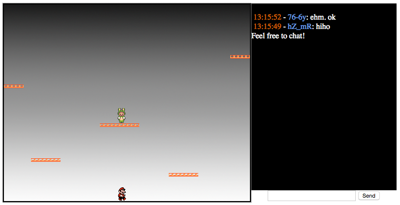

Super Jump'n'Run Wars
=====

Author
-----
Denis Meyer, CallToPower Software

Website
-----
https://sites.google.com/site/calltopowersoftware/

Description
-----
A multiplayer network game (server + client) written in JavaScript using node.js, socket.io, jQuery and HTML5.

Version
-----
1.0.3

License
-----
GNU Lesser General Public License (LGPL), Version 3, 29 June 2007

Used libraries
-----
- not included:
  - node.js (v0.12.7)
  - socket.io (v0.9.16)
- included:
  - jQuery (v1.11.3)

Requirements
-----
- node
  - brew install npm
- grunt
  - npm install grunt@v0.12.7
- socket.io
  - npm install socket.io@0.9.16

Debug Start
-----
- go to src/
- edit variables in files
  - "server/variables.js"
  - "client/js/variables.js"
- edit other variables such as game field size at
  - "server/game/variables.js"
  - "client/js/game/variables.js"
- go to server/ and start server via
	- node server.js
- or compile via
  - grunt build

Release
-----
- edit variables in files
  - "server/variables.js"
  - "client/js/game.js"
- edit other variables such as game field size at
  - "server/game/variables.js"
  - "client/js/game.js"
- grunt build
  - The project resources will be in the folder "Build"
  - Change Build/client/index.html dependencies
- start server via
  - node server.js > log.txt &
